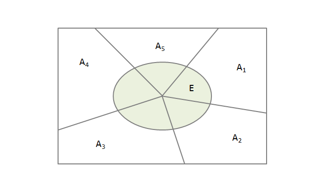
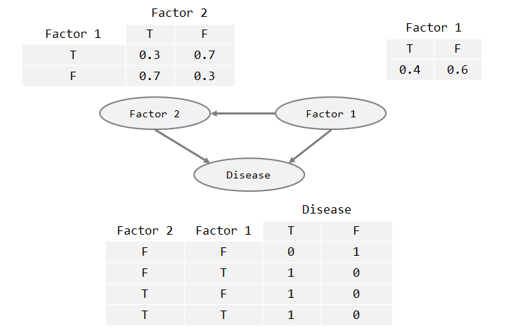

貝氏理論基礎為**條件機率**，說明在一條件下(或稱先驗機率, prior probability)，一事件發生的機率(又稱後驗概率, posterior probability)。條件機率概念如下，若 A, B 為樣本空間 $S$ 中的二事件，且 $P(A) > 0$，則在給定 A 發生下，B 發生之條件機率以 $P(B|A)$ 表示，並定義為

$$
P(B|A) = \frac{P(A \cap B)}{P(A)}, \\
P(A \cap B) = P(B|A)*P(A) ... (1)
$$

以此類推 $P(A \cap B)$ 亦可由在 $P(B) > 0$ 的條件下推算而得 $P(A \cap B) = P(A|B)*P(B) ... (2)$。而若整理上述 $(1)$ 及 $(2)$ 公式，則可得下列結論:

$$
P(A \cap B) = P(B|A)*P(A) = P(A|B)*P(B)\\
\Rightarrow P(B|A) = \frac{P(A|B)*P(B)}{P(A)}
$$

而**貝氏理論**可視為條件機率的延伸說明。
假設一隨機現象的樣本空間為 $S$，若事件 $A_1, A_2, A_3, ..., A_n$ 滿足底下條件

1. $A_1, A_2, A_3, ..., A_n$ 兩兩互斥
2. $A_1 \cup A_2 \cup A_3, ..., \cup A_n = S$

則稱事件 $A_1, A_2, A_3, ..., A_n$ 是樣本空間 $S$ 的一個分割。而貝氏定理擁有 **分割定理** 與 **貝氏定理** 兩個定理。

* 分割原理: 設 $A_1, A_2, A_3, ..., A_n$ 是樣本空間 $S$ 的一個分割，其中 $P(A_k) > 0,k=1,2,3,...,n$，則對任意事件 $E$，恆有

$$
P(E) = P(A_1)*P(E|A_1) + P(A_2)*P(E|A_2) + P(A_3)*P(E|A_3) + ... +  + P(A_n)*P(E|A_n)\\
= \sum_{k=1}^nP(A_k)*P(E | A_k)
$$

特性，可以透過圖像化方式理解，如下：



$A_1, A_2, A_3, ..., A_n$ 是樣本空間 $S$ 的一個分割，$E = (A_1 \cap E) \cup (A_2 \cap E) \cup (A_3 \cap E) \cup ... \cup (A_n \cap E)$ 且 $(A_1 \cap E),(A_2 \cap E), ... ,(A_n \cap E) 兩兩互斥$，故 

$$
P(E) = P(A_1 \cap E) + P(A_2 \cap E) + ... + P(A_n \cap E)\\
= P(A_1)*P(E|A_1) + P(A_2)*P(E|A_2) + ... +  + P(A_n)*P(E|A_n)
$$

* 貝氏定理:設 $A_1, A_2, A_3, ..., A_n$ 是樣本空間 $S$ 的一個分割，其中 $P(A_k) > 0,k=1,2,3,...,n$。若 $E$ 是一事件，且 $P(E) > 0$，則

$$
P(A_i|E) = \frac{P(A_i \cap E)}{P(E)} = \frac{P(A_i)*P(E|A_i)}{\sum_{k=1}^nP(A_k)*P(E|A_k)},i=1,2,...,n
$$

其中 $A_1, A_2, A_3, ..., A_n$ 又可稱為先驗機率。

## 貝氏分類器

### 使用套件

R 中有數個實作出貝氏理論的套件，如 naiveBayes{e1071} 與 NaiveBayes{klaR} 等都是實作函式。而 naiveBayes{e1071} 是以類別資料為對象，而 NaiveBayes{klaR} 則可以用連續資料作為分析對象。

### 安裝套件

貝氏方法可以用於分類，故又稱貝氏分類器，可使用來自於 **e1071** 的套件中 **naiveBayes** 函式來實現。使用的資料集來自於 **mlbench** 套件。

```{r}
packageName <- c("e1071","mlbench")
for(i in 1:length(packageName)) {
  if(!(packageName[i] %in% rownames(installed.packages()))) {
    install.packages(packageName[i])
  }
}
lapply(packageName, require, character.only = TRUE)
```

### 資料準備

使用來自於 **mlbench** 套件中的資料 **HouseVotes84**。其中 class 為輸出變數(要預測的變數)，而其他變數為輸入變數(特徵值)。

```{r}
data("HouseVotes84", package="mlbench")
head(HouseVotes84, 10)
```

### 建立貝氏分類器模型

```r
# the prototype of naiveBayes
# formula: 公式, 如 Class ~ x1 + x2 等或 Class ~ . 等
# laplace: 使用 laplace 平滑調整
# type: 輸出結果內容，class (分類結果)與 raw(機率)
# threshold: 最小閥值
# na.action: NA 值處理方式
naiveBayes(
  formula, data, 
  laplace = 0, type = c("class","raw"), threshold = 0.001, 
  na.action = na.pass, ...)
```

```{r}
set.seed(123)
traning_idx = sample(1:nrow(HouseVotes84),floor(nrow(HouseVotes84)*2/3))
traning_data = HouseVotes84[traning_idx, ]
testing_data = HouseVotes84[-traning_idx, ]
model = naiveBayes(Class ~ ., data=traning_data)
model
```

### 預測資料

* 預測資料

```{r}
pred <- predict(model, testing_data[,-1])
pred
```


* 顯示機率計算的結果

```{r}
predict(model, testing_data[1:10,-1], type="raw")
```

### 建立預測資料的交叉矩陣

```{r}
table(pred, testing_data$Class)
```

---

## 貝氏網路

貝氏網路(又稱信念網路, 有向無環圖模型等)，是一種機率圖型模型，藉由有向無環圖(directed acyclic graphs, or DAGs)中得知一組隨機變數($X_1, X_2, X_3, ..., X_n$)及其 n 組條件機率分配(conditional probability distributions, or CPDs)的性質。舉例而言，貝氏網路可用來表示疾病和相關症狀間的機率關係。



舉上例而言，假設有兩種因子($F1$,$F2$)會導致疾病($D$)發生，但第二個因子會受到第一個因子的影響，就每個因子而言，就只有兩種可能結果:導致(*T*)與不導致(*F*)，則此貝氏網路(如上圖)之聯合機率可表示成：

$$
P(D,F_1,F_2) = P(D|F_1,F_2)*P(F_2|F_1)*P(F_1)
$$
。反之，此模型亦可以回答「假如已知疾病發生，則來自於第一因子造成的機率為何？」等問題，此問題解法如下:

$$
P(F_1=T|D=T) = \frac{P(F_1=T,D=T)}{P(D=T)}\\
=\frac{\sum_{F_2 \in \{T,F\}}P(F_1 = T, S_2, D=T)}{\sum_{F_1,F_2 \in \{T,F\}}P(D=T,F_1,F_2)}\\
=\frac
{(0.4*0.7*1)_{F_1=T,F_2=T,D=T},(0.4*0.3*1)_{F_1=T,F_2=F,D=T}}
{(0.4*0.7*1)_{F_1=T, F_2=T, D=T} + (0.4*0.3*1)_{TFT} + (0.6*0.3*1)_{FTT} + (0)_{FFF}}\\
\approx 0.6896 = 68.96 \%
$$

解貝氏網路是相當複雜的計算，一般而言可以分成底下兩類：

* 精準推論
    * 列舉推理
    * 變數消去法

* 隨機推論(蒙地卡羅方法)
    * 直接取樣
    * 拒絕取樣
    * 概似取樣
    * 馬可夫鏈蒙地卡羅 (Markov chain Monte Carlo, MCMC)

### 安裝套件

貝氏網路可透過 **deal** 來實現，包含如 **network** 等重要函式。

```{r}
packageName <- c("deal")
for(i in 1:length(packageName)) {
  if(!(packageName[i] %in% rownames(installed.packages()))) {
    install.packages(packageName[i])
  }
}
lapply(packageName, require, character.only = TRUE)
```

### 建構網路常用函式介紹

|函式|說明|
|--|--|
| network | 建構網路 |
| localprob | 先驗機率 |
| autosearch | 自動搜索網路 |
| insert | 加入一個有向線(箭頭表示)至網路中 |
| remover | 於網路中移除一個有向線 |
| jointprior | 計算先驗聯合機率分布 |
| learn | 於局部機率分布中估計參數 |
| heuristic | 透過 greedy search 嘗試建立網路，以提升網路分數 |
| getnetwork | 取得建構網路的資料資訊 |
| savenet | 儲存網路 |
| modelstring | 取得建構後的網路資訊 |
| makenw | 創建網路家族譜 |
| gettable | 取得所有的子網路資訊 |
| drawnetwork | 透過互動方式讓使用者建立貝式網路 |
| maketrylist | 為了更快速學習，trylist 作為查找預先定義的父節點 |
| nwfsort | 對網路族作分析，並依網路與得分進行排序 |
| perturb | 對網路做隨機更改，如新增/修改/刪除一條有向線等 |
| score | 網路的分數 |

### 建構網路 (Network)

* 資料準備

```{r}
set.seed(109)
sex <- gl(2,4,labels = c("male","female"))
age <- gl(2,2,8)
yield <- rnorm(length(sex))
weight <- rnorm(length(sex))
allData <- data.frame(sex, age, yield, weight)
```

* 建構網路

```r
# the prototype of network
network(data
  , specifygraph=FALSE, inspectprob=FALSE
  , doprob=TRUE, yr=c(0,350), xr=yr, ...)
```

```{r}
data.network <- network(allData)
```

* 賦予先驗機率

```{r}
localprob(data.network,"sex") <- c(0.6,0.4)
localprob(data.network,"yield") <- c(2.0,0)
localprob(data.network,"weight") <- c(1,0)
data.network
```

* 顯示原始貝氏網路圖

```{r}
plot(data.network)
```

* 學習網路

```{r}
prior <- jointprior(data.network)
data.network <- getnetwork(learn(data.network, allData, prior))
```

* 尋找最佳網路

```{r}
theBestNetwork <- getnetwork(autosearch(data.network, allData, prior))
```

* 顯示貝氏網路內容並儲存網路

```{r}
print(data.network, condposterior = TRUE)
savenet(data.network, file("data.net"))
```

### 自動搜索網路 (autosearch)

* 準備資料

```{r}
data(rats)
head(rats, 10)
```

* 建構並學習網路

```{r}
rats.net <- network(rats)

# 計算聯合先驗機率分布
rats.prior <- jointprior(rats.net, 12)

# learn: 估計機率分布下的參數
# getnetwork: 依據學習後的參數修改網路
rats.net <- getnetwork(learn(rats.net, rats, rats.prior))
```

* 增加方向線

```{r}
# insert: add the arrow from node.2 to node.1
rats.net <- getnetwork(insert(rats.net,2,1, rats, rats.prior))

# insert: add the arrow from node.1 to node.3
rats.net <- getnetwork(insert(rats.net,1,3, rats, rats.prior))
```

* 自動搜索網路

```{r}
# trace: 列出搜尋結果
# removecycles: 搜索網路時，是否排除含有環(cycle)的子網路
rats.net.auto <- autosearch(rats.net, rats, rats.prior, trace = FALSE, removecycles = TRUE)
plot(getnetwork(rats.net.auto))
```

* 探索式建立網路

```{r}
# 透過 greedy search 嘗試建立網路，以提升網路分數
rats.net.hisc <- heuristic(rats.net, rats, rats.prior, restart = 20, trace = FALSE)
plot(getnetwork(rats.net.hisc))
```

* 顯示網路建立狀況 

```{r}
print(modelstring(getnetwork(rats.net.hisc)))
```


### 網路族分析


* 繪出網路族譜

```{r}
plot(makenw(gettable(rats.net.hisc), rats.net))
```


* 對網路族分析

```{r}
nwfsort(makenw(gettable(rats.net.hisc), rats.net))
```


