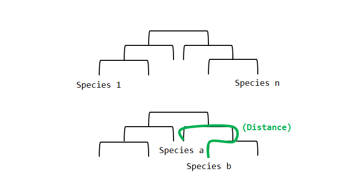
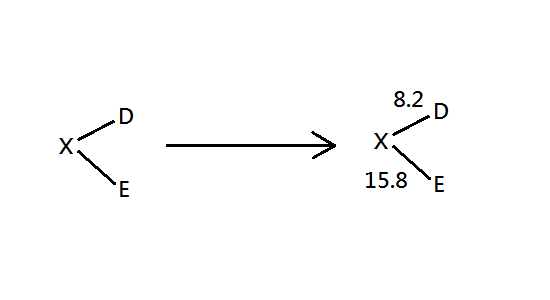
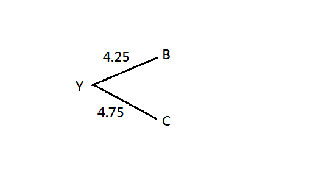
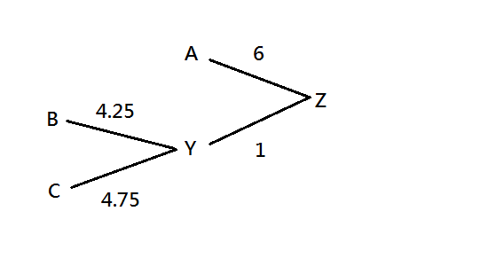
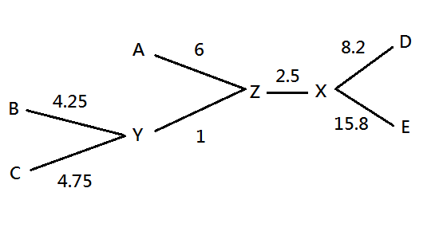

# Neighbor Joining


近鄰結合法為聚合階層分群法的其中一種，使用單一連結演算法為計算方法，最早於 1987 年由 Saitou 提出被用來建構系統發生樹 (phylogenetic trees)。


## 階層樹建構方法

系統發生樹可以以距離基礎(可視為連續資料)或字元基礎(可視為類別資料)來建立，其差別如下表：

| 距離基礎 (distance-based) | 字元基礎 (character-based)   |
| ------------------------- | ---------------------------- |
| 較易實作與較常見          | 較具可靠性與解釋性           |
| 較快, 較簡單              | 較慢, 較複雜                 |
| 可用數值表示差異          | 可以解釋合併或分裂的差異為和 |


字元基礎可以轉換為距離基礎，以分子發生樹為範例，可透過 DNA, RNA 或蛋白質序列為基礎透過近鄰結合法來建立發生樹，概念如下



原始資料可以為將序列資料(或是類別資料)轉換成距離差異，如下

```text
# molecular sequence example
> seqA 
ATCGATCG 
> seqB 
ATCCATCG 
> seqC 
ATCATTCC 
```
由上方的序列結構得出距離差異表

|      | seqA | seqB | seqC |
| ---- | ---- | ---- | ---- |
| seqA | 0    | 1    | 3    |
| seqB | 1    | 0    | 3    |
| seqC | 3    | 3    | 0    |


## 舉物種演化發生樹為範例

底下舉四種動物及其共同蛋白質的基因鹼基對為例。


### 距離差異表

```text
# sequence alignment 
A: gorilla 
B: chimpanzee 
C: human 
D: orangutan 
E: macaque 
```

|      | B    | C    | D    | E    |
| ---- | ---- | ---- | ---- | ---- |
| A    | 11   | 12   | 17   | 24   |
| B    |      | 9    | 16   | 24   |
| C    |      |      | 16   | 24   |
| D    |      |      |      | 24   |


### 聚合階層方式建立樹


#### 步驟 1 (N = 5 nodes remained)


* 計算 $S_x = \sum^{N}_{i=1}{d_{xi}}$，N = operation taxonomic units

    1. $S_A = S_{AB} + S_{AC} + S_{AD} + S_{AE} = 11 + 12 + 17 + 24 = 64$
    2. $S_B = S_{BA} + S_{BC} + S_{BD} + S_{BE} = 11 + 9 + 16 + 24 = 60$
    3. $S_C = 61$
    4. $S_D = 73$
    5. $S_E = 96$


* 計算 $\beta_{ij} = d_{ij}-\frac{S_i + S_j}{N-2}$

    1. $\beta_{AB} = 11 - \frac{64 + 60}{5 - 2} = -30.3$
    2. $\beta_{AC} = 12 - \frac{64+61}{5-2} = -29.7$
    3. $\beta_{AD} = 17 - \frac{64 + 73}{5-2} = -28.7$
    4. 計算所有 $\beta_{ij}$ ($\beta_{ij}$ joined as neighbors)


* 新鄰近矩陣如下 (計算所有的分支長度)

|      | B     | C     | D     | E         |
| ---- | ----- | ----- | ----- | --------- |
| A    | -30.3 | -29.7 | -28.7 | -29.3     |
| B    |       | -29.7 | -28.3 | -28       |
| C    |       |       | -28.7 | -28.3     |
| D    |       |       |       | **-32.3** |


* 建構一顆樹 : 找出最小的分支長度，並加入先前已建立的樹中




* 產生新的節點，合併資料 D 與 E

    1. $d_{DX}=[d_{DE} + \frac{S_D-S_E}{N-2}] / 2 = [24 + \frac{73-96}{3}] / 2 = 8.2$
    2. $d_{EX} = d_{DE}-d_{DX} = 24-8.2 = 15.8$


#### 步驟 2 (N = 4 nodes remained)


* 計算新的 $d_{ij}$ 值

    1. $d_{XA} = (d_{DA} + d_{EA} - d_{DE}) / 2 = (17 + 24 - 24) / 2 = 8.5$
    2. $d_{XB} = (d_{DB} + d_{EB} - d_{DE}) / 2 = (16 + 24 -24)/2 = 8$
    3. $d_{XC} = (d_{DC} + d_{EC} - d_{DE}) / 2 = 8$


* 結合鄰近矩陣如下 (其中 X 代表資料 D 與資料 E)

|      | B    | C    | X    |
| ---- | ---- | ---- | ---- |
| A    | 11   | 12   | 8.5  |
| B    |      | 9    | 8    |
| C    |      |      | 8    |


* 計算 $S_x = \sum^{N}_{i=1}{d_{xi}}$，N = operation taxonomic units

    1. $S_A = S_{AB} + S_{AC} + S_{AX} = 11 + 12 + 8.5 = 31.5$
    2. $S_B = S_{BA} + S_{BC} + S_{BX} = 11 + 9 + 8 = 28$
    3. $S_C = S_{CA} + S_{CB} + S_{CX} = 12 + 9 + 8 = 29$
    4. $S_X = S_{XA} + S_{XB} + S_{XC} = 8.5 + 8 + 8 = 24.5$


* 計算 $\beta_{ij} = d_{ij}-\frac{S_i + S_j}{N-2}$

    1. $\beta_{AB} = 11-(31.5+28)/2 = -18.75$
    2. $\beta_{AC} = 12 - (31.5+29)/2 = -18.25$
    3. 計算所有 $\beta_{ij}$


* 新鄰近矩陣如下 (計算所有的分支長度)

|      | B      | C         | X      |
| ---- | ------ | --------- | ------ |
| A    | -18.75 | -18.25    | -19.5  |
| B    |        | **-19.5** | -18.25 |
| C    |        |           | -18.75 |


* 建構一顆樹 : 找出最小的分支長度，並加入先前已建立的樹中



* 產生新的節點，合併資料 B 與 C

    1. $d_{BY} = [d_{BC} + \frac{S_B - S_C}{N-2}]/2 = [9 + \frac{28-29}{2}]/2=4.25$
    2. $d_{CY} = d_{BC} - d_{BY} = 9 - 4.25 =4.75$


#### 步驟 3 N = 3 nodes remained) 


* 計算新的 $d_{ij}$ 值

    1. X represents both node D and node E 
    2. Y represents both node B and node C
    3. $d_{YA} = (d_{BA} + d_{CA} - d_{BC}) / 2 = (11 + 12 - 9) / 2 = 7$
    4. $d_{YX} = (d_{BX} + d_{CX} -d_{BC})/2 = (8 + 8 - 9)/2=3.5$


* 結合鄰近矩陣如下 (其中 Y 代表資料 B 與資料 C)

|      | Y    | X    |
| ---- | ---- | ---- |
| A    | 7    | 8.5  |
| Y    |      | 3.5  |


* 計算 $S_x = \sum^{N}_{i=1}{d_{xi}}$，N = operation taxonomic units

    1. $S_A = S_{AX} + S_{AY} = 8.5 + 7 = 15.5$
    2. $S_X = S_{XA} + S_{XY} = 8.5 + 3.5 = 12$
    3. $S_Y = S_{YA} + S_{YX} = 7 + 3.5 = 10.5$


* 計算 $\beta_{ij} = d_{ij}-\frac{S_i + S_j}{N-2}$

    1. $\beta_{AY} = 7 – (15.5 + 10.5)/1 = -19 $
    2. $\beta_{AX} = 8.5 – (15.5 + 12)/1 = -19 $
    3. $\beta_{XY} = 3.5 – (12 + 10.5)/1 = -19$


* 新鄰近矩陣如下 (計算所有的分支長度)

|      | Y       | X    |
| ---- | ------- | ---- |
| A    | **-19** | -19  |
| Y    |         | -19  |


* 建構一顆樹 : 找出最小的分支長度，並加入先前已建立的樹中




* 產生新的節點，合併資料 A 與 Y

    1. $d_{AZ} = [d_{AY} + \frac{S_A - S_Y}{N-2}]/2 = [7 + \frac{15.5-10.5}{1}]/2 = 6$
    2. $d_{YZ} = d_{AY} - d_{AZ} = 7 -6 = 1$


#### 步驟 4  (N = 2 nodes remained)


* 計算新的 $d_{ij}$ 值

    1. X represents both node D and node E
    2. Y represents both node B and node C
    3. Z represents both node A and node Y
    4. $d_{XZ} = (d_{AX} + d_{YX} - d_{AY})/2 = (8.5+3.5-7)/2=2.5$


* 結合鄰近矩陣如下 (其中 Z 代表資料 A 與資料 Y)

|      | X    |
| ---- | ---- |
| Z    | 2.5  |


* 計算 $S_x = \sum^{N}_{i=1}{d_{xi}}$，N = operation taxonomic units

1. $S_X = S_{XZ} = 2.5 = S_{XZ} = S_Z$


* 建構一顆樹 : 找出最小的分支長度，並加入先前已建立的樹中



由上方法便可以建立聚集樹。


