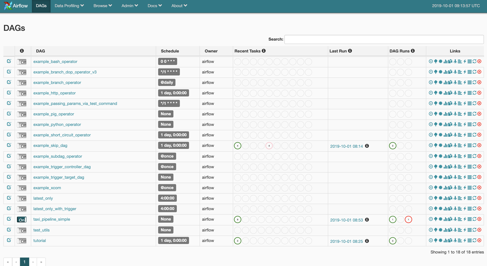
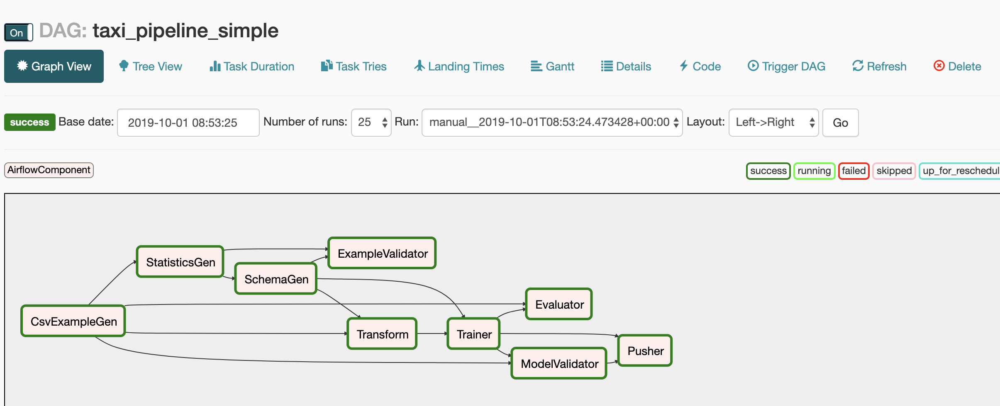
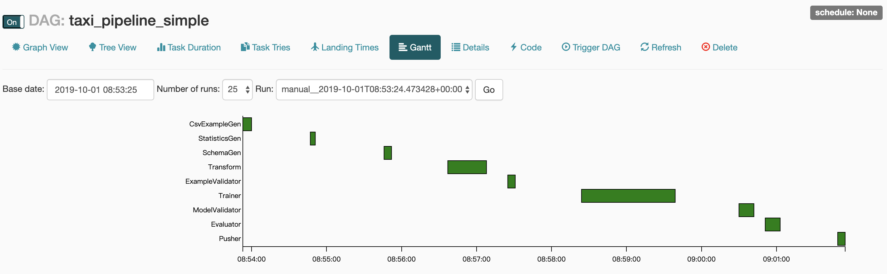

# Tensorflow Extended


Reference:

*   <https://www.tensorflow.org/tfx/guide#developing_with_tfx>


## Concept


### TFX Libraries


Libraries include:

*   **Tensorflow Data Validation (TFDV)**
*   **Tensorflow Transform (TFT)**
*   **Tensorflow**
*   **Tensorflow Model Analysis (TFMA)**
*   **Tensorflow Metadata (TFMD)**
*   **ML Metadata (MLMD)**


Supporting Technologies:

*   **Apache Beam**
*   **Apache Airflow**
*   **Kubeflow**


## Creating and Beginning


### Install Necessary Libraries

```sh
pip install tensorflow==1.14.0 tfx
```


### Creating a TFX Pipeline With Airflow

```sh
source ~/devops/pyenv/tfx/bin/activate

# Airflow
# set this to avoid the GPL version; no functionality difference either way
export SLUGIFY_USES_TEXT_UNIDECODE=yes
pip install apache-airflow
```


### Creating a DAG (directed acyclic graphs).

The tfx pipeline defines functions decorated with the `tfx.runtimes.tfx_airflow.PipelineDecorator`.

You can call `create_pipeline()` to create the pipeline.

```python
@PipelineDecorator(
    pipeline_name='tfx_example_solution',
    schedule_interval=None,
    start_date=datetime.datetime(2018, 1, 1),
    enable_cache=True,
    additional_pipeline_args={'logger_args': logging_utils.LoggerConfig(
        log_root='/var/tmp/tfx/logs', log_level=logging.INFO)},
    metadata_db_root=os.path.join(home_dir, 'data/tfx/metadata'),
    pipeline_root=pipeline_root)
def create_pipeline():
  """Implements the example pipeline with TFX."""
  examples = csv_input(os.path.join(base_dir, 'no_split/span_1'))
  example_gen = CsvExampleGen(input_data=examples)
  statistics_gen = StatisticsGen(input_data=example_gen.outputs.output)
  infer_schema = SchemaGen(stats=statistics_gen.outputs.output)
  validate_stats = ExampleValidator(  # pylint: disable=unused-variable
      stats=statistics_gen.outputs.output,
      schema=infer_schema.outputs.output)
  transform = Transform(
      input_data=example_gen.outputs.output,
      schema=infer_schema.outputs.output,
      module_file=transforms)
  trainer = Trainer(
      module_file=model,
      transformed_examples=transform.outputs.transformed_examples,
      schema=infer_schema.outputs.output,
      transform_output=transform.outputs.transform_output,
      train_steps=10000,
      eval_steps=5000,
      warm_starting=True)
  model_analyzer = Evaluator(
      examples=example_gen.outputs.output,
      model_exports=trainer.outputs.output)
  model_validator = ModelValidator(
      examples=example_gen.outputs.output,
      model=trainer.outputs.output)
  pusher = Pusher(
      model_export=trainer.outputs.output,
      model_blessing=model_validator.outputs.blessing,
      serving_model_dir=serving_model_dir)

  return [
      example_gen, statistics_gen, infer_schema, validate_stats, transform,
      trainer, model_analyzer, model_validator, pusher
  ]

pipeline = TfxRunner().run(create_pipeline())
```


### Initializing Your TFX Pipeline With Airflow

```sh
mkdir $HOME/devops/airflow
export AIRFLOW_HOME=$HOME/devops/airflow

mkdir -p $HOME/devops/airflow/dags     # or $AIRFLOW_HOME/dags
mkdir -p $HOME/devops/airflow/data     # or $AIRFLOW_HOME/data
mkdir -p $HOME/devops/airflow/plugins  # or $AIRFLOW_HOME/plugins
```


#### Pipeline Config

There are two main requirements.

*   The python script containing `create_pipeline()` function must be put in `$AIRFLOW_HOME/dags`.
*   We recommend that if your DAG is named `example`, your should name the python script `example.py`.


#### Deploying Your Pipeline Code

The following is an example to run via tensorflow extended.  We use materials from github repository (https://github.com/tensorflow/tfx/blob/master/tfx/examples/chicago_taxi_pipeline/).

*   pipleline file (`taxi_pipeline_simple.py`)
*   transfrom script for `preprocessing_fn` (`taxt_utils.py`)
*   example dataset (`data.csv`): <https://github.com/tensorflow/tfx/tree/master/tfx/examples/chicago_taxi_pipeline/data/simple> 


The basic directory is as the below.

```text
$HOME +
  |- airflow +                            # export as `AIRFLOW_HOME`
    |- dags +
      |- taxi_pipeline_simple.py          # the example pipeline
    |- data +
    |- plugins +
  |- tfx
    |- metadata +
    |- pipelines +
  |- tfx_taxi
    |- modules +                         # path for module_file
      |- taxt_utils.py
    |- serving_model +                   # the path for exporting models
    |- taxi +
      |- data +
        |- simple +
          |- data.csv -                  # the csv ready for analyzing
```


Based on the above directory, we now edit the pipeline script like the below.

```python
# edit taxi_pipeline_simple.py

# =============================================
# about line 40 ~ 61
# =============================================

# TODO(jyzhao): rename to chicago_taxi_airflow.
_pipeline_name = 'taxi_pipeline_simple'

# This example assumes that the taxi data is stored in ~/taxi/data and the
# taxi utility function is in ~/taxi.  Feel free to customize this as needed.
_taxi_root = os.path.join(os.environ['HOME'], 'devops', 'tfx_taxi')
_data_root = os.path.join(_taxi_root, 'taxi', 'data', 'simple')
# Python module file to inject customized logic into the TFX components. The
# Transform and Trainer both require user-defined functions to run successfully.
_module_file = os.path.join(_taxi_root, "modules", 'taxi_utils.py')
# Path which can be listened to by the model server.  Pusher will output the
# trained model here.
_serving_model_dir = os.path.join(_taxi_root, 'serving_model', _pipeline_name)

# Directory and data locations.  This example assumes all of the chicago taxi
# example code and metadata library is relative to $HOME, but you can store
# these files anywhere on your local filesystem.
_tfx_root = os.path.join(os.environ['HOME'], 'tfx')
_pipeline_root = os.path.join(_tfx_root, 'pipelines', _pipeline_name)
# Sqlite ML-metadata db path.
_metadata_path = os.path.join(_tfx_root, 'metadata', _pipeline_name,
                              'metadata.db')
```


### Deploying and Operating a TFX Pipeline

#### Initializing the airflow

```sh
# Initialize sqlite db. (Or you face sqlite querying error.)
airflow initdb
```


#### Starting and Updating Your Pipeline

```sh
# -p : port
# -D : run on the background
airflow webserver [-p 8081] [-D]

# scheduler must be activated for arranging workers doing jobs
airflow scheduler
```

#### ScreenShot

The web UI.



Graph view.



Gantt view.

